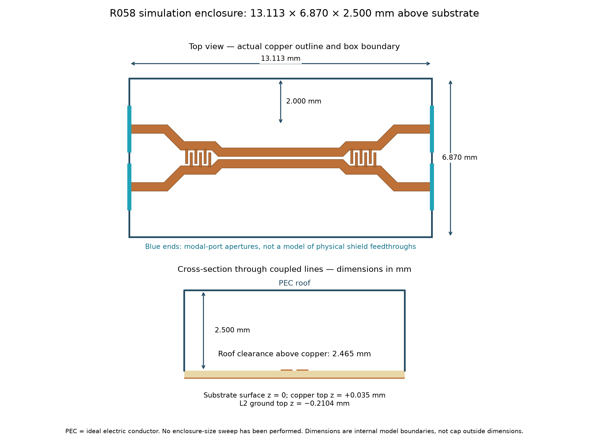

# FunRad symmetric coupler footprint

`library/FunRad.pretty/FunRad_Coupler_5GHz8_Symmetric_15dB.kicad_mod` is ready to load as a KiCad footprint. It is a **prototype RF layout**, not a production-qualified design.

## Import

In the Footprint Editor, use **File → Import → Footprint** and select the `.kicad_mod`, or add `library/FunRad.pretty` through **Preferences → Manage Footprint Libraries**. Use the project-specific library table if it should travel with the project. Place it on the top side.

| Pad | Function | Pad centre, mm |
|---|---|---|
| 1 | PA input | −6.371518, −1.250000 |
| 2 | Antenna / through | +6.371518, −1.250000 |
| 3 | Coupled detector output | −6.371518, +1.250000 |
| 4 | Isolated port; terminate in 50 Ω | +6.371518, +1.250000 |

Origin is the geometry centre. KiCad y points down, preserving the visible top/bottom assignment. Terminal pad centres sit 0.185 mm inside the simulated end planes; copper end planes are x=±6.556518 mm. Connect with 0.37 mm traces without widening the feed.

## Integration

- Top copper is the saved simulation outline, rounded to 1 nm coordinates. Pads 1 and 3 are connected custom shapes; pads 2 and 4 overlap their respective conductor ends. Net-tie groups `1,2` and `3,4` permit intended DC continuity while retaining four schematic nets. Use a four-pin symbol with those numbers. The two conductors remain isolated from each other.
- **L2 must be uninterrupted ground**, 0.2104 mm below top copper, on the intended JLC04161H-7628 stack. A footprint cannot enforce stack-up; no ground plane or opening is embedded here. Top copper is 35 µm; modeled εr=4.4. Confirm the ordered process.
- One F.Mask rectangle exposes copper **and gaps**, with 0.25 mm margin; no F.Paste exists. Do not add mask between the lines or fingers. Finish loading/loss is not yet modeled.
- The later R058 check includes bulk copper loss on the same geometry: minimum sampled directivity 30.50 dB, coupling −15.419 to −15.166 dB. The strict −15±0.3 dB band window is not met at the upper end; the footprint is unchanged, and a retune or coupling calibration decision remains.
- The F.Cu rule area excludes pours and vias around the structure. Tracks/pads remain routable for the ports; keep unrelated tracks/pads out manually. It does not cut L2. The 2 mm lateral margin reflects modeled empty space, not a validated universal clearance to hardware.
- Nominal interconductor clearance is 0.10 mm; local pad clearance is 0.09 mm. Confirm absolute board minimum constraints and manufacturer DRC. Do not relax unrelated board rules.
- Excluded from BOM and placement files: this is etched copper. The courtyard is an integration guide, not a shield outline.

Format and net-tie behavior follow [KiCad's official footprint specification](https://dev-docs.kicad.org/en/file-formats/sexpr-intro/index.html#_footprint).

## Verification

### Simulated enclosure (R058)

The last run uses a 13.113036 × 6.870 mm domain, with PEC roof at z=+2.500 mm relative to the substrate surface. Copper top is z=+0.035 mm, leaving 2.465 mm roof clearance. Long side walls are 2.000 mm beyond the copper bounding outline. L2 ground top is z=−0.2104 mm. The four modal-port apertures occupy the x-end faces; they do not model real cap feedthroughs.

These are internal simulation dimensions, not a shield ordering specification. A larger enclosure changes wall loading and cavity modes; no size-convergence sweep has demonstrated negligible influence. Use this as a reference for choosing a candidate cap, then check its actual inner height, wall locations and signal exits in the model. The board and any other circuitry sharing the shield also matter.

Loaded with KiCad 9.0.7. Each custom pad merges to one connected outline. Polygon unions agree with saved EM geometry within 0.000001 mm² per conductor; only coordinate rounding is intended. The import fixture reports **0 DRC violations and 0 unconnected items**.

The fixture and its check files are not kept in the repository; `python -m tests.footprint` regenerates them into `validation/`. `coupler_import_check.kicad_pcb` is only an import/net-tie DRC fixture: it has no RF launches or fabrication-ready ground design and must not be ordered. `drc.json`, `geometry_check.json` and `footprint_preview.svg` record the checks. They do not validate the real board, mask process limits or RF performance.

Recreate with `python -m exports.footprint` in `Frontend/emerge`; from the same directory run `python -m tests.footprint` with KiCad's bundled Python. `coupler_export.json` records the source hash and port coordinates.
