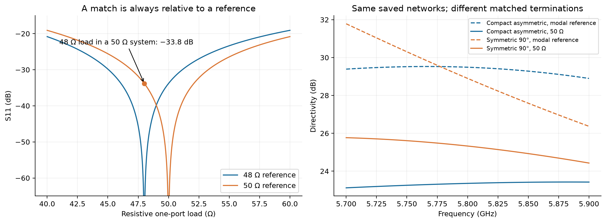
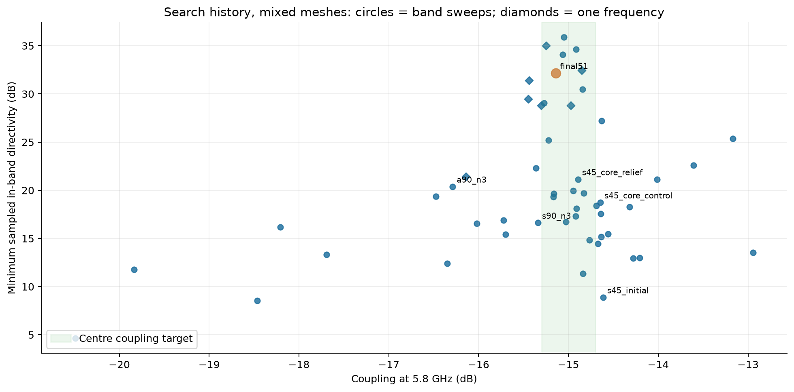
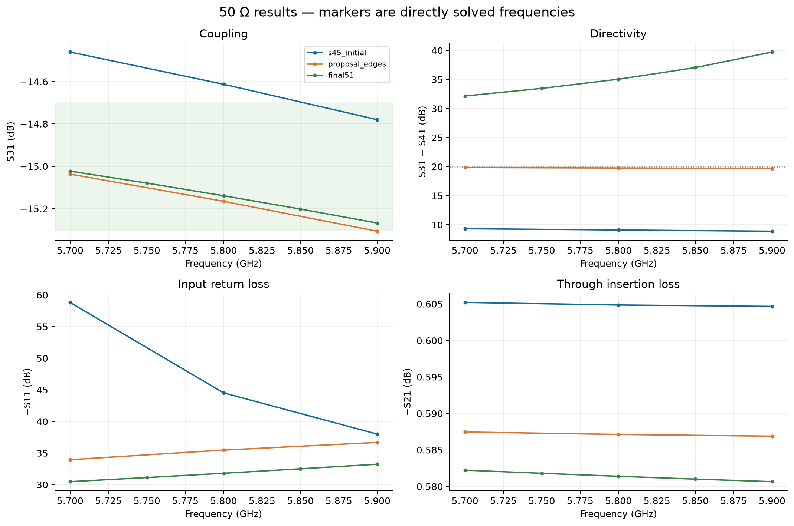
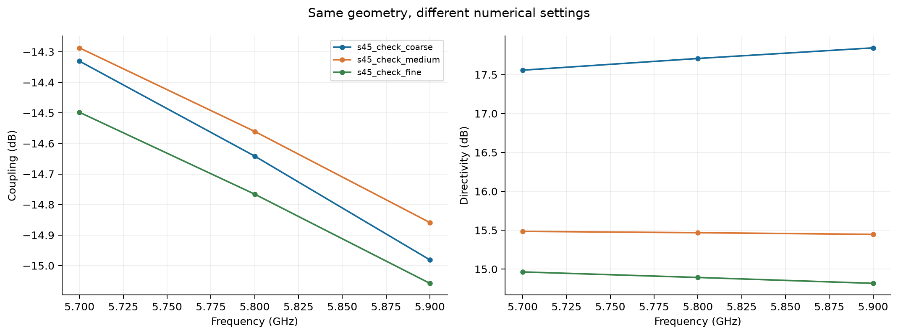
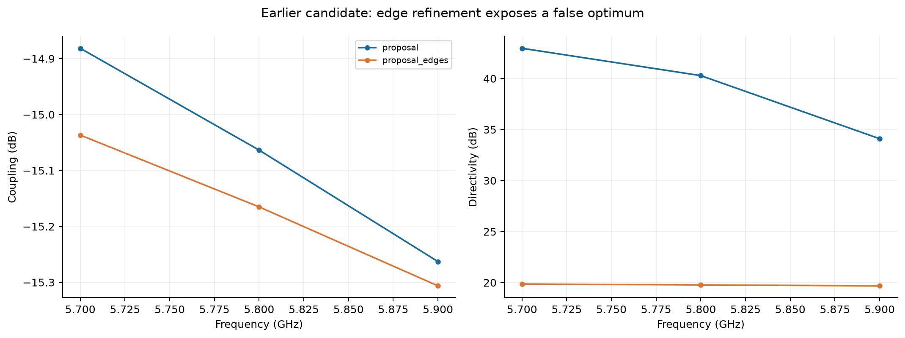
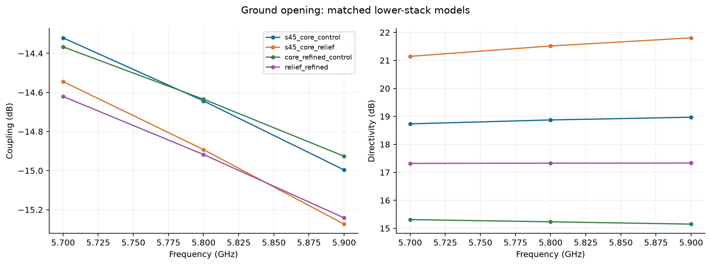

# Coupler redesign study — 2026-09-17–18

This is a separate design investigation following [[Coupler Results Audit]]. The original scripts, defaults and result files remain available. New experiments live in `Frontend/emerge/results_redesign/`, with their exact configurations, actual copper outlines, raw solved S matrices, extracted reference impedances, mesh counts and driver snapshots. No interpolated curve is presented as a new EM measurement.

The objective is a useful 5.8 GHz TX monitoring coupler on JLC04161H-7628: nominal coupling near -15 dB over 5.7–5.9 GHz, good directivity and input match, and features compatible with a standard multilayer fabrication process. Both centre-frequency accuracy and whole-band coupling range are reported, rather than silently interchanging the two requirements. This study uses 50-ohm terminations throughout. Results are simulations, not measured hardware.

**Recommendation:** prototype the symmetric 45-degree, intact-ground `final51` geometry: 5.10 mm coupled length, 0.37 mm lines, 0.13 mm coupled gap, and three 0.10 mm fingers per side with 0.10 mm slots and 0.48 mm overlap. Five direct edge-refined solves give 32.16–39.73 dB directivity, −15.27 to −15.02 dB coupling and at least 30.48 dB input return loss. At 5.8 GHz, illustrative material/dimensional perturbations reduce directivity to 28.80–32.46 dB and move coupling outside the nominal tolerance in some cases. This is the strongest new prototype candidate in this investigation, with remaining mesh, material and hardware validation work described below.

## What renormalization means

S11 is a ratio of reflected to incident wave amplitude, but those waves are defined using a reference impedance. For a one-port with real reference impedance:

$$S_{11}=\Gamma=\frac{Z_\mathrm{in}-Z_\mathrm{ref}}{Z_\mathrm{in}+Z_\mathrm{ref}}.$$

A 48-ohm resistor is perfectly matched to a 48-ohm system: S11=0, or minus infinity dB. The same resistor in a 50-ohm system has Gamma=-2/98=-0.020408, so S11=-33.8 dB. The resistor has not changed. The question asked of it has.



Left: a resistive one-port illustrates why a reported match needs its reference stated. Right: old saved coupler data illustrates the much larger consequence for a cancellation-based isolation response. Dashed curves use the extracted modal references; solid curves use 50 ohm. These old curves are vector-fitted historical data, unlike the new raw-frequency results below.

For a four-port, S11 also assumes that ports 2, 3 and 4 are terminated in their reference impedances. More precisely, the other incident wave amplitudes are zero under that wave definition. Renormalizing all ports to 50 ohm changes what those matched terminations represent. Reflections from the other ports can return through the network, changing the input reflection and the isolated-port signal. Therefore changing the reference can change every entry, not only S11. One cannot convert a general four-port correctly from S11 alone.

For real per-port reference impedances, define R=diag(sqrt(Zref)). The conversion used for an independent check is:

$$Y=R^{-1}(I-S)(I+S)^{-1}R^{-1},\qquad S_{50}=(I-50Y)(I+50Y)^{-1}.$$

These describe the same physical network. With actual source and load impedances held fixed and represented correctly, either reference convention predicts the same circuit behaviour. Renormalization is not a matching circuit, not de-embedding, and not a repair for an inaccurate EM model. For complex references, wave conventions need additional care; the study preserves the full extracted impedances and uses EMerge's power-wave conversion. See [scikit-rf's reference-impedance example](https://scikit-rf.readthedocs.io/en/latest/examples/networktheory/Renormalizing%20S-parameters.html).

## Design choices and their rationale

The earlier Claude-assisted work found a useful compensation mechanism, but the evidence was weaker than its conclusions. The main issues were ranking modal-reference results as if they described 50-ohm loads, using 0.06 mm comb gaps below the cited standard process limit, treating fitted curves as if they supplied independent frequency samples, and lacking an effective mesh-convergence check. My own first high-directivity redesign also failed an edge-refinement check. These are workflow and verification problems; a plausible geometry and a deep plotted null are not sufficient evidence by themselves. The detailed historical comparison is in [Coupler Results Audit](Coupler%20Results%20Audit.md).

- **Use 0.10 mm or larger finger width, finger-to-finger gap and finger-tip-to-opposite-bus clearance.** JLCPCB lists 0.09/0.09 mm for standard 1 oz multilayer boards. A nominal 0.10 mm rule clears that published limit, although it does not establish tolerance yield. Source: [JLCPCB capabilities](https://jlcpcb.com/capabilities/Capab), checked 2026-09-17.
- **Replace the tiny vertical transition remnants with clean 45-degree transitions.** The new symmetric 45-degree routes use genuine diagonal sections with square joins at the direction changes; they do not use the old over-cut 45-degree mitre construction. Both actual outline drawings and minimum opposite-net edge distances are checked.
- **Start with an intact ground plane.** This keeps the return path simple. Ground relief is treated as an additional experiment, with a lower dielectric region and L3 included. Cutting a hole at the outer boundary of a PEC-bounded model would not meaningfully remove that boundary.
- **Tune compensation and coupling together.** More finger overlap can deepen isolation while weakening coupling and worsening matching. Gap, coupled width and coupled length must therefore be evaluated with the complete compensation structure present.
- **Use raw solved points for exploration, then denser direct solves for shortlisted candidates.** Initial scans solve 5.7, 5.8 and 5.9 GHz. They establish sampled behaviour, not a proven continuous-band minimum. No 601-point vector fit is used to hide this distinction.

The initial two-finger comb was deliberately small. It gave only 8.9 dB minimum sampled directivity and established that substantially more compensation was required. Increasing to three fingers and increasing overlap improved isolation, but several of those candidates became under-coupled. Those rejected results are retained alongside the successful ones.

## Model controls and surprises

**Ground placement: an initial suspicion was not confirmed.** Inspection showed that the old thick ground polygon was extruded upward from -0.2104 to -0.1754 mm. On its own that drawing suggests the wrong dielectric spacing, and I initially reported it as such. However, EMerge assigns the substrate priority 11 and that ground object default priority 10; the dielectric wins where they overlap. The straight-line control changed extracted impedance only from 48.01 to 47.88 ohm when the ground was moved below the substrate. The evidence does not support blaming a 35 um spacing error for the port discrepancy. The new model removes the ambiguity by placing the ground entirely below the dielectric and giving copper explicit priority.

**Port refinement is not yet a solved problem.** A 10 mm straight-line control at 0.20 mm port mesh gave approximately 47.88 ohm. At 0.10 mm port mesh it gave 48.75 ohm. A 0.05 mm test selected an unphysical 0.276-ohm mode after a slow eigensolve; it was stopped and excluded. A failed eigenmode is not a convergence result. These controls support retaining a numerical uncertainty qualification even after converting to 50 ohm.

**Loss and environment.** Unless explicitly stated otherwise, copper is PEC and FR-4 uses er=4.4, tan(delta)=0.020; copper thickness is 35 um and signal-to-L2 dielectric height 0.2104 mm. Through loss includes dielectric loss and power diverted to other ports but omits finite copper conductivity, surface finish and roughness. The enclosure uses the inherited bounded-domain approach, not a validated open-board radiation environment. Bare-copper geometry assumes soldermask is kept off the coupler. The final board's lid, nearby routing, terminations and detector connection require inclusion before release.

## Results

The result tables and figures below are populated from the completed raw simulations. Exact configurations can be recovered from the named run directories, rather than inferred from a filename or a schematic sketch.

<!-- RESULTS -->

### Proposed geometry

The selected prototype candidate has symmetric 45-degree fan-outs, a shorter coupled section and three manufacturable fingers per side at each end. The ground stays intact. This is a simulated prototype proposal; it is not a production-qualified layout.


| Dimension | mm |
|---|---:|
| Coupled length | 5.10 |
| Coupled and feed width | 0.37 |
| Coupled gap | 0.13 |
| Line centre spacing at comb | 1.05 |
| Straight comb station length | 1.20 |
| Finger width / finger gap | 0.10 / 0.10 |
| Finger overlap | 0.48 |
| Finger length beyond bus edge | 0.58 |
| Finger tip to opposite bus | 0.10 |
| Comb span along x | 1.10 |

P1 is the PA input, P2 goes to the antenna, P3 is the coupled output, and P4 requires a good 50-ohm termination. The 0.10 mm minimum opposite-net outline clearance has been checked from the actual generated copper polygons. Keep soldermask off this modeled bare-copper RF area; this study does not include mask loading.

### What changed the outcome

The initial, smaller comb did not provide enough compensation. Increasing finger count and overlap helped, but preserving the original near-quarter-wave coupled length left a difficult coupling/directivity trade-off. The useful change was shortening the coupled run: the complete structure includes two transitions, two extended capacitors and their loading, so the uniform unloaded section's quarter-wave length is not a constraint on the optimum complete device. This is an interpretation of the observed sweep, not a fitted equivalent-circuit proof.

The selected 5.10 mm section is 31% shorter than the old 7.39 mm section. Its 0.13 mm main gap is wider than the original 0.10 mm and the previous compact study's 0.11 mm; comb slots grow from 0.06 to 0.10 mm. The first short-section candidates appeared to exceed 34 dB on the surface mesh. Explicit edge refinement rejected that numerical optimum: the earlier `proposal` fell to 19.7 dB. A targeted overlap/spacing retune was then performed on the edge-refined model itself, followed by coupled-length adjustment to restore coupling. The final table distinguishes those stages instead of selecting the largest number from incompatible meshes.



Each point is one completed simulation configuration. This plot mixes exploration and validation meshes and therefore documents the search; it must not be read as a ranking at identical numerical accuracy. Diamonds have only one solved frequency: their minimum is just that one value. The green band marks the centre-frequency coupling target only. A table range with one direct sample is not a bandwidth result.

| Run | Direct band samples | S31 at 5.8 (dB) | S31 band range (dB) | Min sampled D (dB) | Min RL (dB) | IL at 5.8 (dB) |
|---|---:|---:|---:|---:|---:|---:|
| `s45_initial` | 3 | -14.61 | -14.78 to -14.46 | 8.89 | 38.00 | 0.605 |
| `s45_n3_o0.40_s0.12` | 3 | -16.47 | -16.94 to -16.05 | 19.37 | 21.09 | 0.584 |
| `s45_trim_w0.39` | 3 | -14.83 | -15.19 to -14.49 | 19.71 | 28.23 | 0.606 |
| `s45_check_medium` | 3 | -14.56 | -14.86 to -14.29 | 15.45 | 36.28 | 0.624 |
| `s45_check_fine` | 3 | -14.77 | -15.06 to -14.50 | 14.82 | 37.16 | 0.616 |
| `s45_L6_w0.37` | 3 | -13.17 | -13.37 to -12.99 | 25.37 | 35.48 | 0.654 |
| `short_ref_s0.12` | 3 | -14.63 | -14.85 to -14.43 | 27.22 | 33.53 | 0.597 |
| `short_ref_s0.13` | 3 | -15.27 | -15.52 to -15.05 | 29.04 | 31.05 | 0.575 |
| `short_fine` | 3 | -15.05 | -15.29 to -14.83 | 35.87 | 35.71 | 0.581 |
| `short55_fine` | 3 | -14.84 | -15.01 to -14.69 | 30.49 | 34.33 | 0.578 |
| `candidate_A` | 3 | -15.22 | -15.56 to -14.91 | 25.21 | 32.22 | 0.596 |
| `proposal` | 3 | -15.06 | -15.26 to -14.88 | 34.10 | 35.54 | 0.573 |
| `proposal_edges` | 3 | -15.17 | -15.31 to -15.04 | 19.68 | 33.95 | 0.587 |
| `edge_tune_o48` | 1 | -15.45 | -15.45 to -15.45 | 29.46 | 36.01 | 0.578 |
| `edge_tune_o60` | 1 | -16.14 | -16.14 to -16.14 | 21.44 | 30.01 | 0.568 |
| `edge_short53` | 1 | -15.25 | -15.25 to -15.25 | 35.01 | 33.99 | 0.580 |
| `final51` | 5 | -15.14 | -15.27 to -15.02 | 32.16 | 30.48 | 0.581 |

### Final response and numerical checks



The main sweep (`final51`) contains 5 direct samples in 5.7–5.9 GHz. At 5.8 GHz its coupling is -15.14 dB, isolation -50.19 dB and through insertion loss 0.581 dB. Its minimum sampled directivity is 32.16 dB, and minimum input return loss is 30.48 dB. Connecting lines in the figures are visual guides, not extra EM samples.

The selected geometry uses 283,633 tetrahedra, 0.04 mm requested edge refinement, 0.15 mm trace surface size and 0.10 mm port face size. All final sensitivity comparisons retain these settings. This is a substantially stronger numerical check than the exploration mesh, but a further successful refinement or independent solver comparison is still needed to establish convergence of the isolation null.



An early exact-geometry control (`s45_check_*`) changed from 17.56 dB directivity at the exploration settings to 15.45 dB at the intermediate settings and 14.82 dB at the finer surface settings. Its port impedance moved from approximately 47.84 to 48.75 ohm. This is why early numerical peaks were not accepted as final answers.



The earlier candidate's 0.04 mm edge-refinement check has 288,485 tetrahedra. Its minimum sampled directivity is **19.68 dB**, coupling spans **-15.31 to -15.04 dB**, and return loss is at least **33.95 dB**. It invalidated the apparent 34 dB optimum and motivated the retune. The final design must be evaluated using its own result above. No claim of asymptotic convergence follows merely from selecting an edge mesh.

For the main sweep, the largest S-matrix singular value is 0.970735 and the maximum complex reciprocity residual is 9.06e-04. These are basic consistency checks, not proof of physical accuracy.

### Ground relief experiment




| Run | Direct band samples | S31 at 5.8 (dB) | S31 band range (dB) | Min sampled D (dB) | Min RL (dB) | IL at 5.8 (dB) |
|---|---:|---:|---:|---:|---:|---:|
| `s45_core_control` | 3 | -14.64 | -15.00 to -14.32 | 18.73 | 28.90 | 0.613 |
| `s45_core_relief` | 3 | -14.89 | -15.27 to -14.54 | 21.15 | 31.40 | 0.599 |
| `core_refined_control` | 3 | -14.63 | -14.93 to -14.37 | 15.15 | 34.42 | 0.622 |
| `relief_refined` | 3 | -14.92 | -15.24 to -14.62 | 17.32 | 37.02 | 0.606 |

The comparison includes a 1.065 mm core with er=4.6 and 15.2 um inner copper, using the published [JLC04161H-7628 stack](https://jlcpcb.com/impedance). The exploratory aperture is 0.50 mm wide across y, extends 0.05 mm beyond each end of the comb span along x, and leaves an intact L3 plane. The core-backed intact control and aperture case are evaluated at the same settings in each pair. The final short-section design was found without an aperture, so it avoids introducing an additional return-current discontinuity. Ground relief remains an unoptimized alternative, not a demonstrated universal improvement.

### Sensitivity: nominal performance is not production yield


| Run | Direct band samples | S31 at 5.8 (dB) | S31 band range (dB) | Min sampled D (dB) | Min RL (dB) | IL at 5.8 (dB) |
|---|---:|---:|---:|---:|---:|---:|
| `final51` | 5 | -15.14 | -15.27 to -15.02 | 32.16 | 30.48 | 0.581 |
| `final51_er42` | 1 | -14.97 | -14.97 to -14.97 | 28.81 | 30.33 | 0.577 |
| `final51_er46` | 1 | -15.30 | -15.30 to -15.30 | 28.80 | 34.07 | 0.586 |
| `final51_narrow` | 1 | -15.44 | -15.44 to -15.44 | 31.39 | 32.39 | 0.575 |
| `final51_wide` | 1 | -14.85 | -14.85 to -14.85 | 32.46 | 31.45 | 0.589 |

At 5.8 GHz the completed perturbations give directivity from 28.80 to 32.46 dB and coupling from -15.44 to -14.85 dB. The nominal coupling passes the ±0.3 dB window at all five sampled frequencies, but these illustrative corners do not all remain inside that window. This is a candidate for a test coupon, not evidence that an uncalibrated production design meets the coupling tolerance.

The dielectric checks use er=4.2 and 4.6 as illustrative brackets around the provisional 4.4 value; these are not supplier-guaranteed tolerance limits. The dimensional checks change all trace/finger widths by ±0.01 mm, spaces by the opposite amount, and overlap consistently with the bus-edge movement. They are correlated parameter perturbations, not an exact morphological etch model: rebuilding bends also changes their locations slightly. These sensitivity runs use the same 0.04 mm edge-refinement settings as the main sweep, at 5.8 GHz only. They do not establish worst-case band performance or manufacturing yield. The nominal 0.10 mm features become 0.09 mm in the relevant dimensional corner.

Do not interpret a deep nominal isolation null as guaranteed production performance. The remaining release work is to establish actual laminate/etch distributions, include conductor and finish loss, confirm the complete board/shield/load environment, and measure a coupon with suitable calibration structures. Coupling calibration may be appropriate for a monitoring tap; it should be an explicit system decision, not an excuse to mark an out-of-window simulation as passing.

The dataset currently contains 52 completed four-port experiments plus the straight-line controls. The full numerical catalogue is `Frontend/emerge/results_redesign/summary.csv`; all original raw results remain in their run folders.

## Reproduction

Use the existing `Frontend/emerge/.venv/Scripts/python.exe` environment with EMerge 2.8.9. Run from `Frontend/emerge`:

```text
python redesign.py redesign_configs/NAME.json
python redesign_summary.py
python redesign_geometry_check.py
python redesign_figures.py
python redesign_write_report.py
```

Each run folder is named from the experiment label and a hash of its complete configuration. A completed run is reused rather than overwritten. `raw.npz` holds directly solved frequencies, full S matrices at the modal reference and 50 ohm, and port impedances. `layout.json` contains the actual trace outlines; `clearance.json` checks opposite-net outline clearance only and is not a replacement for a PCB manufacturer's complete DRC. `mesh.json`, `config.json`, `driver_snapshot.py` and the per-experiment log retain the numerical setup. The original `coupler_sim.py` is reused for trace construction; its version remains unchanged during this study.
