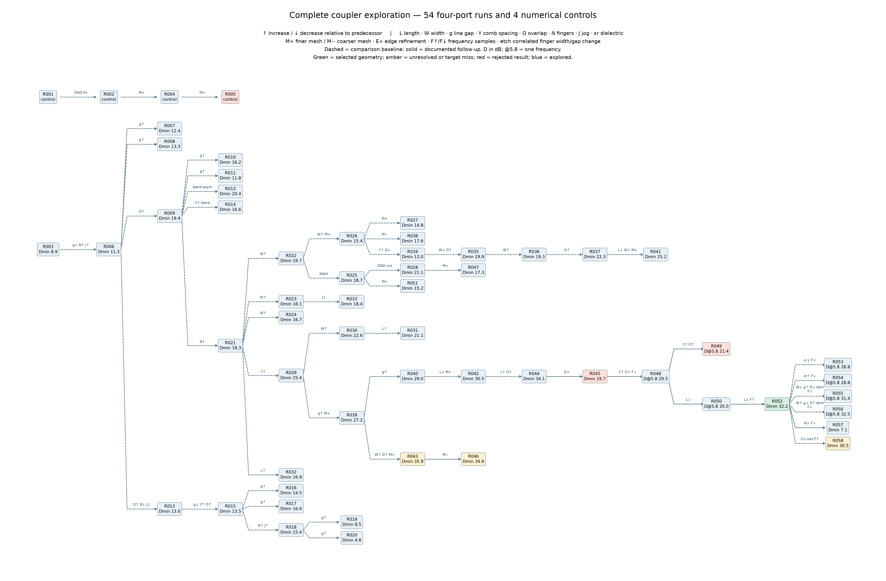
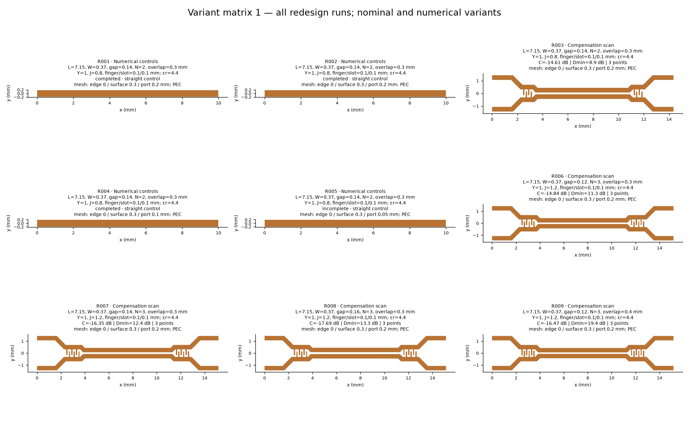
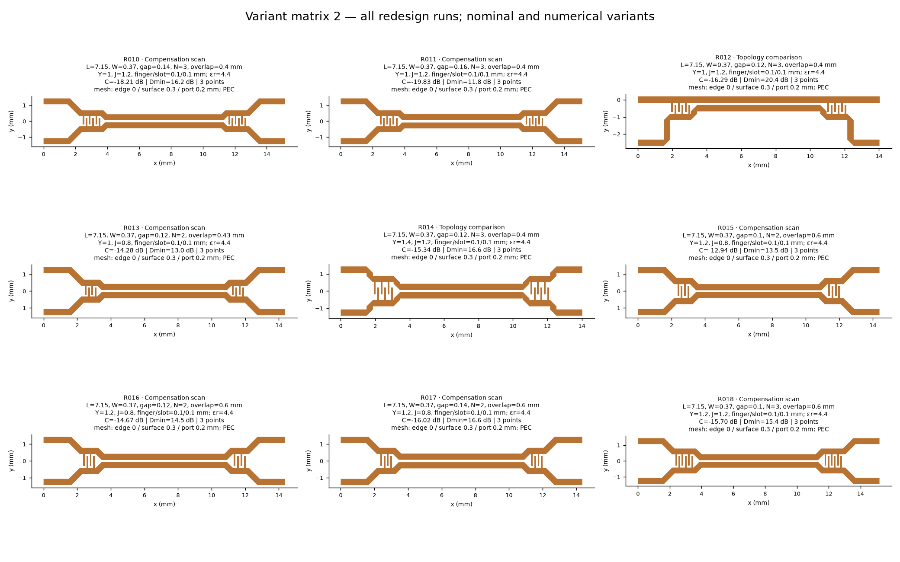
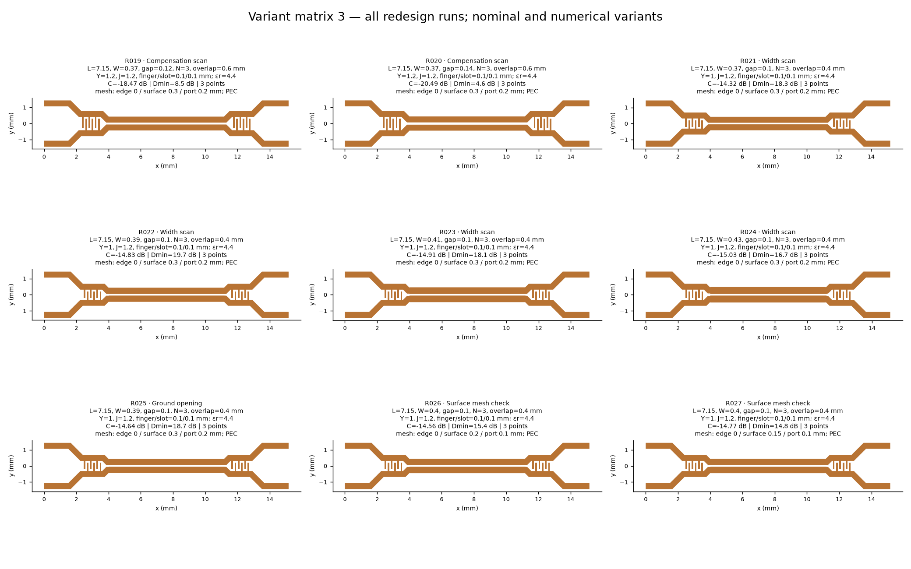
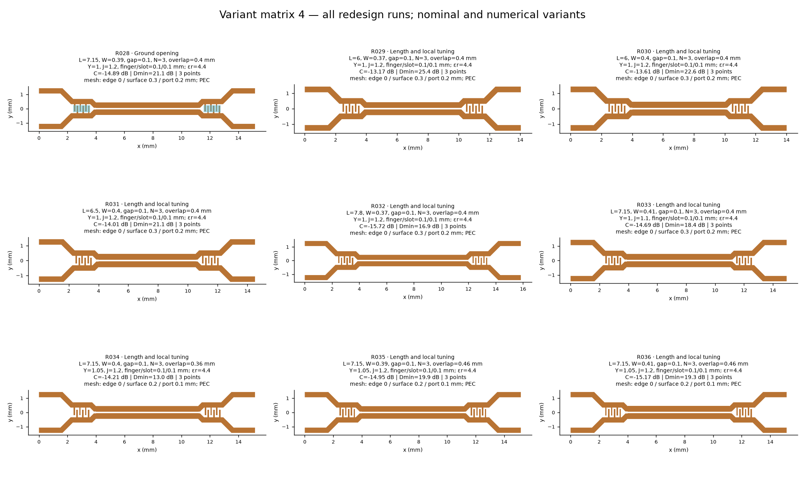
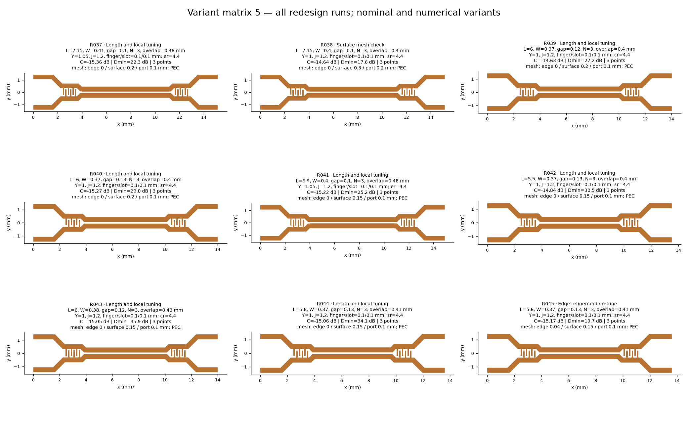
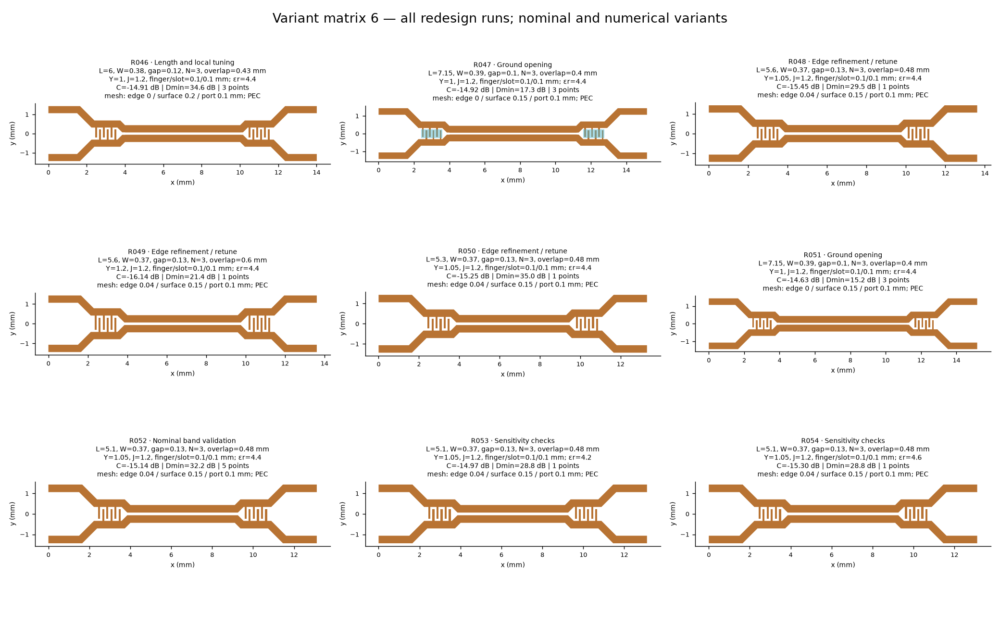
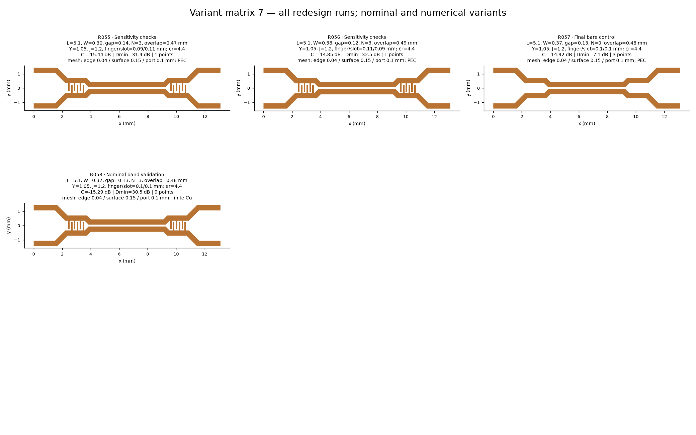

# Coupler simulation catalogue

The design argument is in [[TX Coupler EM Method]]. This page is the complete redesign variant matrix; the database also retains the older fitted studies. IDs are stable; original filenames remain searchable aliases.

[SQLite database](../../Frontend/emerge/catalogue/coupler_simulations.sqlite) · [Searchable local table](../../Frontend/emerge/catalogue/index.html) · [Database schema and queries](../../Frontend/emerge/catalogue/README.md)

**Reading the data:** all reported metrics use 50 Ω. One-point experiments do not establish a band minimum. Exploration, surface-refined and edge-refined runs are different fidelity levels. Historical fitted curves are not independent EM samples. Chronology uses saved configuration timestamps; stage/rationale labels are a retrospective reconstruction of the actual search, not an optimizer log.

## Decision tree

[Open the full tree as a zoomable SVG](images/coupler/solution_tree_full.svg)

**54 coupler runs + 4 numerical controls.** Arrow labels summarize changes relative to the preceding node; ↑ / ↓ mean increase / decrease. L = coupled length, W = trace width, g = line gap, Y = comb spacing, O = overlap, N = finger count, J = jog. M+ / M− = finer / coarser surface or port mesh; E+ = explicit edge refinement; F↑ / F↓ = more / fewer frequency samples. Other changes are named directly. Exact values remain in the table and database.

Solid arrows are documented follow-ups; dashed arrows are retrospective comparison baselines, not a claimed chronological ancestry. Dmin is the minimum over sampled frequencies; D@5.8 is a single-frequency result. Green marks the selected geometry, amber unresolved checks or a target miss, and red rejected results.

The selected path is **R044 → R045 (reject the apparent peak) → R048 → R050 → R052**. R043/R046 remain without edge validation. R058 adds copper loss and denser sampling, exposing a small coupling-target miss. The ground branch compares R051 (intact) with R047 (aperture) at matching refinement.

## Animated search and geometry matrix

| ID | Description | Original alias | Samples | Coupling at 5.8 (dB) | Min sampled D (dB) |
|---|---|---|---:|---:|---:|
| R001 | Straight-line control · port mesh 0.20 mm · old ground | `straight_legacy` | 3 | — | — |
| R002 | Straight-line control · port mesh 0.20 mm | `straight_corrected` | 3 | — | — |
| R003 | Symmetric 45° · L 7.15 / W 0.37 / gap 0.14 · 2 fingers / overlap 0.3 | `s45_initial` | 3 | -14.61 | 8.89 |
| R004 | Straight-line control · port mesh 0.10 mm | `line_p10` | 3 | — | — |
| R005 | Straight-line control · port mesh 0.05 mm | `line_p05` | — | — | — |
| R006 | Symmetric 45° · L 7.15 / W 0.37 / gap 0.12 · 3 fingers / overlap 0.3 | `s45_n3_o0.30_s0.12` | 3 | -14.84 | 11.35 |
| R007 | Symmetric 45° · L 7.15 / W 0.37 / gap 0.14 · 3 fingers / overlap 0.3 | `s45_n3_o0.30_s0.14` | 3 | -16.35 | 12.39 |
| R008 | Symmetric 45° · L 7.15 / W 0.37 / gap 0.16 · 3 fingers / overlap 0.3 | `s45_n3_o0.30_s0.16` | 3 | -17.69 | 13.34 |
| R009 | Symmetric 45° · L 7.15 / W 0.37 / gap 0.12 · 3 fingers / overlap 0.4 | `s45_n3_o0.40_s0.12` | 3 | -16.47 | 19.37 |
| R010 | Symmetric 45° · L 7.15 / W 0.37 / gap 0.14 · 3 fingers / overlap 0.4 | `s45_n3_o0.40_s0.14` | 3 | -18.21 | 16.19 |
| R011 | Symmetric 45° · L 7.15 / W 0.37 / gap 0.16 · 3 fingers / overlap 0.4 | `s45_n3_o0.40_s0.16` | 3 | -19.83 | 11.76 |
| R012 | Asymmetric 90° · L 7.15 / W 0.37 / gap 0.12 · 3 fingers / overlap 0.4 | `a90_n3` | 3 | -16.29 | 20.38 |
| R013 | Symmetric 45° · L 7.15 / W 0.37 / gap 0.12 · 2 fingers / overlap 0.43 | `s45_n2_o43` | 3 | -14.28 | 12.97 |
| R014 | Symmetric 90° · L 7.15 / W 0.37 / gap 0.12 · 3 fingers / overlap 0.4 | `s90_n3` | 3 | -15.34 | 16.63 |
| R015 | Symmetric 45° · L 7.15 / W 0.37 / gap 0.1 · 2 fingers / overlap 0.6 | `s45_n2_long_s0.10` | 3 | -12.94 | 13.54 |
| R016 | Symmetric 45° · L 7.15 / W 0.37 / gap 0.12 · 2 fingers / overlap 0.6 | `s45_n2_long_s0.12` | 3 | -14.67 | 14.47 |
| R017 | Symmetric 45° · L 7.15 / W 0.37 / gap 0.14 · 2 fingers / overlap 0.6 | `s45_n2_long_s0.14` | 3 | -16.02 | 16.56 |
| R018 | Symmetric 45° · L 7.15 / W 0.37 / gap 0.1 · 3 fingers / overlap 0.6 | `s45_n3_long_s0.10` | 3 | -15.70 | 15.41 |
| R019 | Symmetric 45° · L 7.15 / W 0.37 / gap 0.12 · 3 fingers / overlap 0.6 | `s45_n3_long_s0.12` | 3 | -18.47 | 8.54 |
| R020 | Symmetric 45° · L 7.15 / W 0.37 / gap 0.14 · 3 fingers / overlap 0.6 | `s45_n3_long_s0.14` | 3 | -20.49 | 4.63 |
| R021 | Symmetric 45° · L 7.15 / W 0.37 / gap 0.1 · 3 fingers / overlap 0.4 | `s45_trim_w0.37` | 3 | -14.32 | 18.29 |
| R022 | Symmetric 45° · L 7.15 / W 0.39 / gap 0.1 · 3 fingers / overlap 0.4 | `s45_trim_w0.39` | 3 | -14.83 | 19.71 |
| R023 | Symmetric 45° · L 7.15 / W 0.41 / gap 0.1 · 3 fingers / overlap 0.4 | `s45_trim_w0.41` | 3 | -14.91 | 18.12 |
| R024 | Symmetric 45° · L 7.15 / W 0.43 / gap 0.1 · 3 fingers / overlap 0.4 | `s45_trim_w0.43` | 3 | -15.03 | 16.71 |
| R025 | Symmetric 45° · L 7.15 / W 0.39 / gap 0.1 · 3 fingers / overlap 0.4 | `s45_core_control` | 3 | -14.64 | 18.73 |
| R026 | Symmetric 45° · L 7.15 / W 0.4 / gap 0.1 · 3 fingers / overlap 0.4 | `s45_check_medium` | 3 | -14.56 | 15.45 |
| R027 | Symmetric 45° · L 7.15 / W 0.4 / gap 0.1 · 3 fingers / overlap 0.4 | `s45_check_fine` | 3 | -14.77 | 14.82 |
| R028 | Symmetric 45° · L 7.15 / W 0.39 / gap 0.1 · 3 fingers / overlap 0.4 | `s45_core_relief` | 3 | -14.89 | 21.15 |
| R029 | Symmetric 45° · L 6 / W 0.37 / gap 0.1 · 3 fingers / overlap 0.4 | `s45_L6_w0.37` | 3 | -13.17 | 25.37 |
| R030 | Symmetric 45° · L 6 / W 0.4 / gap 0.1 · 3 fingers / overlap 0.4 | `s45_L6_w0.4` | 3 | -13.61 | 22.60 |
| R031 | Symmetric 45° · L 6.5 / W 0.4 / gap 0.1 · 3 fingers / overlap 0.4 | `s45_L6.5_w0.4` | 3 | -14.01 | 21.14 |
| R032 | Symmetric 45° · L 7.8 / W 0.37 / gap 0.1 · 3 fingers / overlap 0.4 | `s45_L7.8_w0.37` | 3 | -15.72 | 16.89 |
| R033 | Symmetric 45° · L 7.15 / W 0.41 / gap 0.1 · 3 fingers / overlap 0.4 | `s45_short_jog` | 3 | -14.69 | 18.41 |
| R034 | Symmetric 45° · L 7.15 / W 0.4 / gap 0.1 · 3 fingers / overlap 0.36 | `refine_o0.36_w0.40` | 3 | -14.21 | 13.01 |
| R035 | Symmetric 45° · L 7.15 / W 0.39 / gap 0.1 · 3 fingers / overlap 0.46 | `refine_o0.46_w0.39` | 3 | -14.95 | 19.95 |
| R036 | Symmetric 45° · L 7.15 / W 0.41 / gap 0.1 · 3 fingers / overlap 0.46 | `refine_o0.46_w0.41` | 3 | -15.17 | 19.30 |
| R037 | Symmetric 45° · L 7.15 / W 0.41 / gap 0.1 · 3 fingers / overlap 0.48 | `refine_o0.48_w0.41` | 3 | -15.36 | 22.29 |
| R038 | Symmetric 45° · L 7.15 / W 0.4 / gap 0.1 · 3 fingers / overlap 0.4 | `s45_check_coarse` | 3 | -14.64 | 17.56 |
| R039 | Symmetric 45° · L 6 / W 0.37 / gap 0.12 · 3 fingers / overlap 0.4 | `short_ref_s0.12` | 3 | -14.63 | 27.22 |
| R040 | Symmetric 45° · L 6 / W 0.37 / gap 0.13 · 3 fingers / overlap 0.4 | `short_ref_s0.13` | 3 | -15.27 | 29.04 |
| R041 | Symmetric 45° · L 6.9 / W 0.4 / gap 0.1 · 3 fingers / overlap 0.48 | `candidate_A` | 3 | -15.22 | 25.21 |
| R042 | Symmetric 45° · L 5.5 / W 0.37 / gap 0.13 · 3 fingers / overlap 0.4 | `short55_fine` | 3 | -14.84 | 30.49 |
| R043 | Symmetric 45° · L 6 / W 0.38 / gap 0.12 · 3 fingers / overlap 0.43 | `short_fine` | 3 | -15.05 | 35.87 |
| R044 | Earlier apparent optimum · surface mesh | `proposal` | 3 | -15.06 | 34.10 |
| R045 | Same earlier geometry · edge refinement | `proposal_edges` | 3 | -15.17 | 19.68 |
| R046 | Symmetric 45° · L 6 / W 0.38 / gap 0.12 · 3 fingers / overlap 0.43 | `short_ref_o43` | 3 | -14.91 | 34.61 |
| R047 | Symmetric 45° · L 7.15 / W 0.39 / gap 0.1 · 3 fingers / overlap 0.4 | `relief_refined` | 3 | -14.92 | 17.32 |
| R048 | Edge retune · 0.48 mm overlap | `edge_tune_o48` | 1 | -15.45 | 29.46 |
| R049 | Edge retune · 0.60 mm overlap | `edge_tune_o60` | 1 | -16.14 | 21.44 |
| R050 | Edge-refined candidate · 5.3 mm section | `edge_short53` | 1 | -15.25 | 35.01 |
| R051 | Symmetric 45° · L 7.15 / W 0.39 / gap 0.1 · 3 fingers / overlap 0.4 | `core_refined_control` | 3 | -14.63 | 15.15 |
| R052 | Selected symmetric prototype | `final51` | 5 | -15.14 | 32.16 |
| R053 | Selected geometry · dielectric εr 4.2 | `final51_er42` | 1 | -14.97 | 28.81 |
| R054 | Selected geometry · dielectric εr 4.6 | `final51_er46` | 1 | -15.30 | 28.80 |
| R055 | Selected geometry · widths −10 µm / gaps +10 µm | `final51_narrow` | 1 | -15.44 | 31.39 |
| R056 | Selected geometry · widths +10 µm / gaps −10 µm | `final51_wide` | 1 | -14.85 | 32.46 |
| R057 | Selected geometry without combs | `final51_bare` | 3 | -14.92 | 7.11 |
| R058 | Selected geometry · finite copper · nine band points | `final51_copper9` | 9 | -15.29 | 30.50 |
