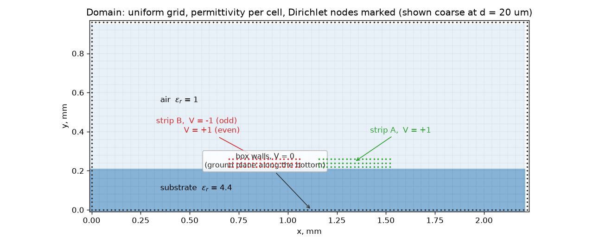
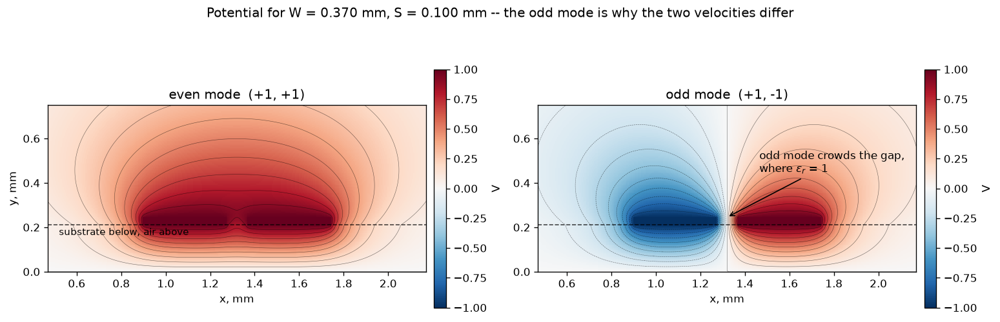

# Quasi-static 2-D solver

The solver turns a **uniform microstrip cross-section into even/odd impedances and phase velocities**. The sequence is:

$$
\text{geometry}\ \longrightarrow\ V(x,y)\ \longrightarrow\ Q'\ \longrightarrow\ C'_e,C'_o\ \longrightarrow\ L'_m,Z_{0m},\varepsilon_{\mathrm{eff},m}.
$$

[Implementation](../../Frontend/emerge/simulation/coupled_2d.py) · [Final diagnostic](../../Frontend/emerge/catalogue/final_cross_section.json) · [[TX Coupler EM Method]]

**Role in this design.** It informed early line-width and compensation estimates. The final $W=0.37$ mm, $S=0.13$ mm, $\ell=5.10$ mm and comb geometry were selected by 3-D EM sweeps. The results below are a cross-section check performed **after selection**, on 2026-09-20.

## 1. Define the cross-section and modal voltages

The model is invariant along the propagation direction $z$. Two rectangular conductors of width $W$ and thickness $t$ sit on a dielectric of thickness $h$, above a ground plane. Their edge gap is $S$. Air fills the region above the substrate. Copper is an equipotential boundary; the electrostatic solve uses real permittivity and contains no conductor or dielectric loss.

| Boundary | Even mode | Odd mode |
|---|---:|---:|
| Strip A | $+V_t$ | $+V_t$ |
| Strip B | $+V_t$ | $-V_t$ |
| Ground, lid and side walls | 0 | 0 |

The code uses $V_t=1$ V. In the even mode the symmetry plane between strips has zero normal electric field. In the odd mode it is a virtual ground, $V=0$. The implementation solves the **whole pair**, so these symmetry conditions emerge without imposing a separate centre boundary.



*Illustration: historical $W=0.37$ mm, $S=0.10$ mm example, coarse 20 µm grid and reduced box for visibility. It shows the boundary construction, not the final diagnostic's dimensions.*

## 2. Solve for potential, then integrate charge

There is no free charge inside the dielectric or air. With $\mathbf E=-\nabla V$ and $\mathbf D=\varepsilon_0\varepsilon_r\mathbf E$, Gauss's law gives

$$
\nabla\cdot\mathbf D=0
\quad\Rightarrow\quad
\boxed{\nabla\cdot(\varepsilon_r\nabla V)=0.}
$$

A uniform square grid replaces this equation by a five-point stencil. At an unknown node $P$,

$$
\sum_{n\in\{E,W,N,S\}}\bar\varepsilon_{Pn}(V_n-V_P)=0.
$$

Here $\bar\varepsilon_{Pn}$ is the relative permittivity assigned to the connection between nodes. The code averages the adjacent cell values arithmetically. Fixed-potential nodes supply the boundary terms of the sparse system $\mathbf A\mathbf V=\mathbf b$, solved by `scipy.sparse.linalg.spsolve`.

The charge **per unit propagation length** on strip A follows from the outward electric flux:

$$
Q'_A=\oint_{\partial A}\mathbf D\cdot\hat{\mathbf n}\,ds
\simeq\varepsilon_0\sum_{\substack{P\in A\\n\notin A}}\bar\varepsilon_{Pn}(V_A-V_n).
$$

The sum includes connections crossing the strip boundary. On a square grid of spacing $d$, the normal field is $E_n\simeq(V_A-V_n)/d$, and the corresponding boundary segment has length $d$. Its charge per unit conductor length is therefore $\Delta Q'\simeq\varepsilon E_n d=\varepsilon(V_A-V_n)$: the two explicit $d$ factors cancel. Grid spacing still affects the voltages and represented geometry. Thus $Q'_A$ has units C/m. This is the charge extraction in `_solve()`.



**How this illustration is generated.** [`fields_fig()`](../../Frontend/emerge/reports/cross_section_figures.py) calls `field()` twice on the same cross-section: first with $(V_A,V_B)=(+1,+1)$ V, then with $(+1,-1)$ V. Each call solves the sparse potential system from Step 2 and returns the node values $V_{ij}$. Matplotlib plots these values as colours on a common $-1$ to $+1$ V scale; the black curves are equipotentials, spaced by 0.1 V from $-0.9$ to $+0.9$ V. The dashed horizontal line marks the substrate–air interface.

The electric field is $\mathbf E=-\nabla V$: it points perpendicular to the equipotentials, towards lower potential. Closer contours mean a stronger field. Thus the odd-mode contours show the strong field across the gap; colour alone represents **potential**, not field strength or energy density.

Figure inputs: historical $W=370$ µm, $S=100$ µm, $t=35$ µm, $h=210.4$ µm, $\varepsilon_r=4.4$ and $d=5$ µm. The lid is 900 µm above the copper top, with 900 µm lateral padding per side; all outer boundaries are grounded. The displayed view is cropped around the strips. These illustration settings differ from the final diagnostic in Step 5.

## 3. Obtain the modal capacitances — four electrostatic solves

For either excitation, the **per-line modal capacitance** is

$$
C'_m=\frac{Q'_A}{V_t},\qquad m\in\{e,o\}.
$$

The odd mode has a 2 V difference between strips, but the modal voltage of strip A relative to the virtual ground is **1 V**. Dividing its charge by 2 V would instead give the differential-pair capacitance $C'_{\mathrm{diff}}=C'_o/2$; that is not the normalization used here.

For a symmetric pair, this can also be read from the capacitance matrix:

$$
\begin{bmatrix}Q'_A\\Q'_B\end{bmatrix}
=\begin{bmatrix}C'_{11}&C'_{12}\\C'_{12}&C'_{11}\end{bmatrix}
\begin{bmatrix}V_A\\V_B\end{bmatrix},
\qquad C'_{12}<0,
$$

The first row is $Q'_A=C'_{11}V_A+C'_{12}V_B$. Substitute the voltages for each excitation:

**Even mode:** $V_A=V_B=V_t$, hence

$$
Q'_{A,e}=(C'_{11}+C'_{12})V_t
\quad\Rightarrow\quad C'_e=\frac{Q'_{A,e}}{V_t}=C'_{11}+C'_{12}.
$$

**Odd mode:** $V_A=V_t$, $V_B=-V_t$, hence

$$
Q'_{A,o}=(C'_{11}-C'_{12})V_t
\quad\Rightarrow\quad C'_o=\frac{Q'_{A,o}}{V_t}=C'_{11}-C'_{12}.
$$

Both capacitances use the same strip voltage $V_t$, but **different charges**, because the neighbouring strip's voltage changes. Since $C'_{12}<0$, $C'_e<C'_o$.

Repeat both excitations with **all dielectric replaced by air**, keeping geometry, grid and grounded boundaries identical:

| Solve | Dielectric | Excitation | Output |
|---|---|---|---|
| 1 | Actual substrate | Even | $C'_e$ |
| 2 | Air everywhere | Even | $C'_{ae}$ |
| 3 | Actual substrate | Odd | $C'_o$ |
| 4 | Air everywhere | Odd | $C'_{ao}$ |

This is exactly what `modes()` does. The auxiliary air solves supply the inductance information needed next.

## 4. Derive inductance, impedance and effective permittivity

For a lossless modal transmission line, the telegrapher equations are

$$
\frac{\partial V_m}{\partial z}=-L'_m\frac{\partial I_m}{\partial t},\qquad
\frac{\partial I_m}{\partial z}=-C'_m\frac{\partial V_m}{\partial t}.
$$

Differentiating once more gives a wave equation with speed and travelling-wave impedance

$$
v_m=\frac{1}{\sqrt{L'_mC'_m}},\qquad Z_{0m}=\sqrt{\frac{L'_m}{C'_m}}.
$$

These are the standard lossless-line results; see David M. Pozar, [*Microwave Engineering*, 4th ed., Chapter 2, “Transmission Line Theory”](https://bcs.wiley.com/he-bcs/Books?action=chapter&bcsId=6874&chapterId=74177&itemId=0470631554). Links point to Wiley's book companion pages; the derivation is included here so the calculation remains self-contained.

For the **air-filled reference**, propagation is TEM at $c$, hence

$$
L'_mC'_{am}=\frac{1}{c^2}.
$$

Under the quasi-TEM approximation, replacing air with a **nonmagnetic dielectric** changes electric energy and capacitance, while the external inductance is taken from the same air-filled geometry. Therefore

$$
\boxed{L'_m\simeq\frac{1}{c^2C'_{am}}}\qquad[\mathrm{H/m}].
$$

This air-reference relation follows from the TEM speed identity above. For the underlying TEM/quasi-TEM treatment, see Pozar, [*Microwave Engineering*, 4th ed., Chapter 3, “Transmission Lines and Waveguides”](https://bcs.wiley.com/he-bcs/Books?action=chapter&bcsId=6874&chapterId=74178&itemId=0470631554); for coupled-line even/odd analysis, see [Chapter 7, “Power Dividers and Directional Couplers”](https://bcs.wiley.com/he-bcs/Books?action=chapter&bcsId=6874&chapterId=74182&itemId=0470631554). Here the air-reference calculation is applied separately to each mode, with the same per-line normalization.

Substituting this inductance into the preceding line equations yields

$$
\boxed{Z_{0m}\simeq\frac{1}{c\sqrt{C'_mC'_{am}}}},\qquad
v_m\simeq c\sqrt{\frac{C'_{am}}{C'_m}}.
$$

Define effective relative permittivity by $v_m=c/\sqrt{\varepsilon_{\mathrm{eff},m}}$. Then

$$
\boxed{\varepsilon_{\mathrm{eff},m}\simeq\frac{C'_m}{C'_{am}}},\qquad
\beta_m=\frac{\omega}{c}\sqrt{\varepsilon_{\mathrm{eff},m}}.
$$

Thus the first three quantities all follow from the same four capacitance calculations. The resulting $Z_{0o}$ is a **per-line odd-mode impedance**; the corresponding differential impedance is $2Z_{0o}$.

## 5. Apply the calculation to the selected cross-section

Nominal inputs: $W=370$ µm, $S=130$ µm, $t=35$ µm, $h=210.4$ µm and $\varepsilon_r=4.4$. The diagnostic uses 1.5 mm lateral padding per side and a grounded lid **2.5 mm above the copper top**. This 2-D box differs from the 3-D box, whose roof is 2.5 mm above the substrate surface.

| Grid $d$, µm | Represented $t$, µm | Represented $h$, µm | $Z_{0e}$, Ω | $Z_{0o}$, Ω | $\varepsilon_e$ | $\varepsilon_o$ | $\sqrt{Z_{0e}Z_{0o}}$, Ω |
|---|---:|---:|---:|---:|---:|---:|---:|
| 10 | 40 | 210 | 58.112 | 37.804 | 3.4345 | 2.6963 | 46.871 |
| 5 | 35 | 210 | 58.425 | 38.448 | 3.4369 | 2.7163 | 47.396 |

Dimensions are rounded to grid nodes. The refinement changes both discretization and represented copper thickness; it is not a pure fixed-geometry convergence test. The 210.4 µm dielectric is represented as 210 µm on both grids.

For the selected length $\ell=5.10$ mm and $f=5.8$ GHz, the modal phase difference follows directly from $\theta_m=\beta_m\ell$:

$$
\Delta\theta=(\beta_e-\beta_o)\ell
=\frac{2\pi f\ell}{c}(\sqrt{\varepsilon_e}-\sqrt{\varepsilon_o})
=7.309^\circ\quad(d=5\ \mathrm{\mu m}).
$$

The modes travel at different speeds because they distribute their electric fields differently between air and substrate. Route symmetry permits the even/odd decomposition; it does not remove this velocity split. The compensation argument and finite-length EM results are developed in [[TX Coupler EM Method]].

## 6. What the result establishes

| Available from this model | Requires the complete 3-D network |
|---|---|
| Uniform-line impedances and effective permittivities | Bends, transitions and finite-length matching |
| Modal velocity difference | Comb capacitance, inductance and end fringing |
| Trends with thickness, width, gap and lid position | Four-port coupling, isolation and directivity |

The two grids move $Z_{0o}$ by 0.64 Ω; they do not establish an uncertainty interval. Grid rounding, the permittivity stencil and finite box boundaries all affect the result. A convergence study would vary grid and box size while controlling the represented geometry.

The geometric mean in the last column is a diagnostic. The condition $\sqrt{Z_{0e}Z_{0o}}=50\ \Omega$ applies to ideal uniform coupled-line synthesis; a comb-loaded network with transitions must be assessed by its complete S-matrix. This cross-section solve does not extract the final comb's capacitance or reproduce the 3-D performance.

## 7. Reproduce

From `Frontend/emerge`:

```powershell
.\.venv\Scripts\python.exe -m tests.cross_section
```

Or call the solver explicitly:

```python
from simulation.coupled_2d import modes
ze, zo, ee, eo = modes(
    370.0, 130.0, t_um=35.0, er=4.4, h_um=210.4,
    d_um=5.0, lid_um=2500.0, xpad_um=1500.0,
)
```

The values and phase calculation are saved in [final_cross_section.json](../../Frontend/emerge/catalogue/final_cross_section.json). Regenerate the first illustration with `python -m reports.cross_section_figures domain`, or the second with `python -m reports.cross_section_figures fields`. Their reduced boxes and the first figure's coarse grid are intentional illustration settings.
