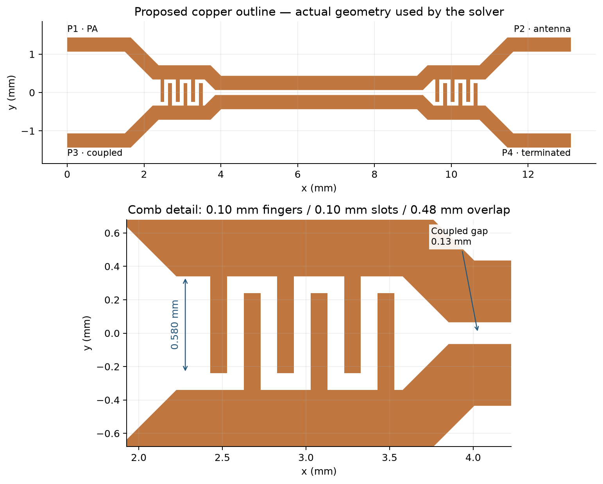
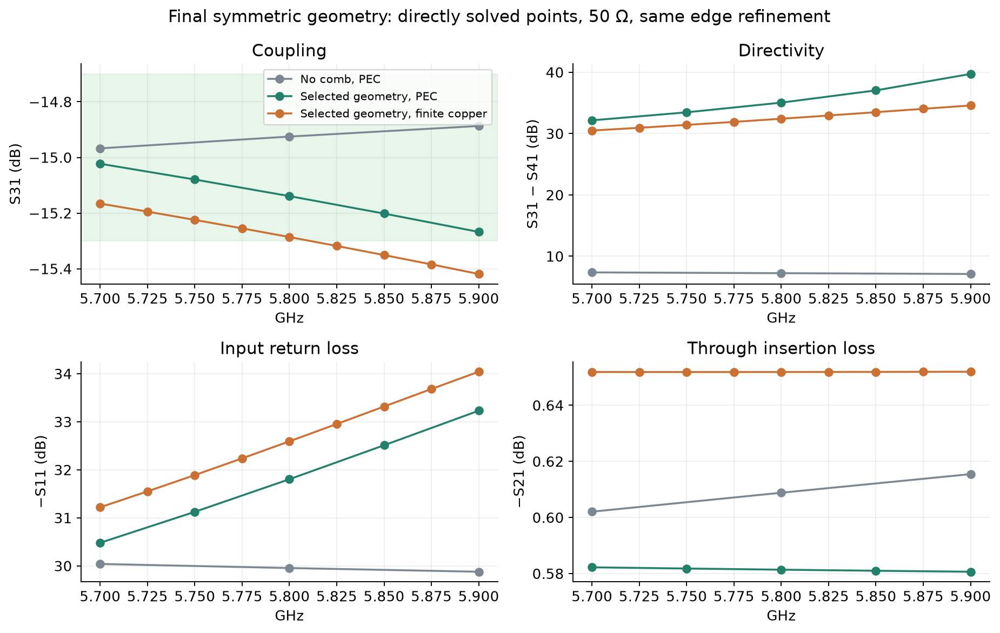
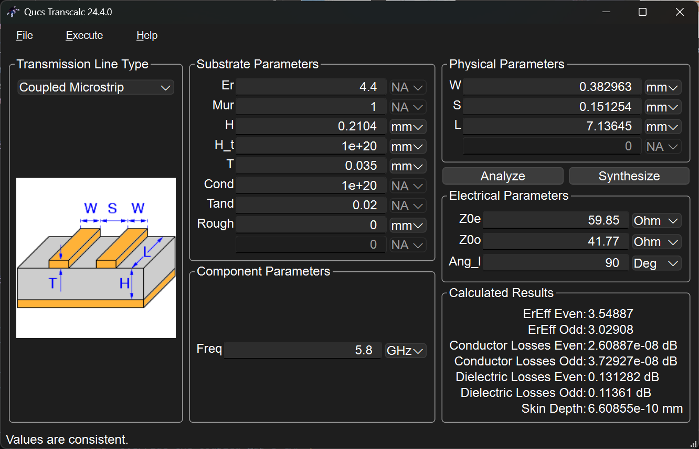
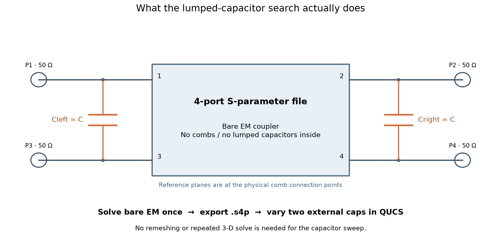
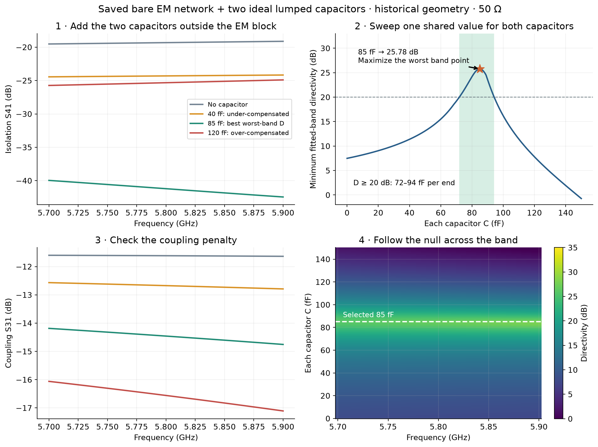
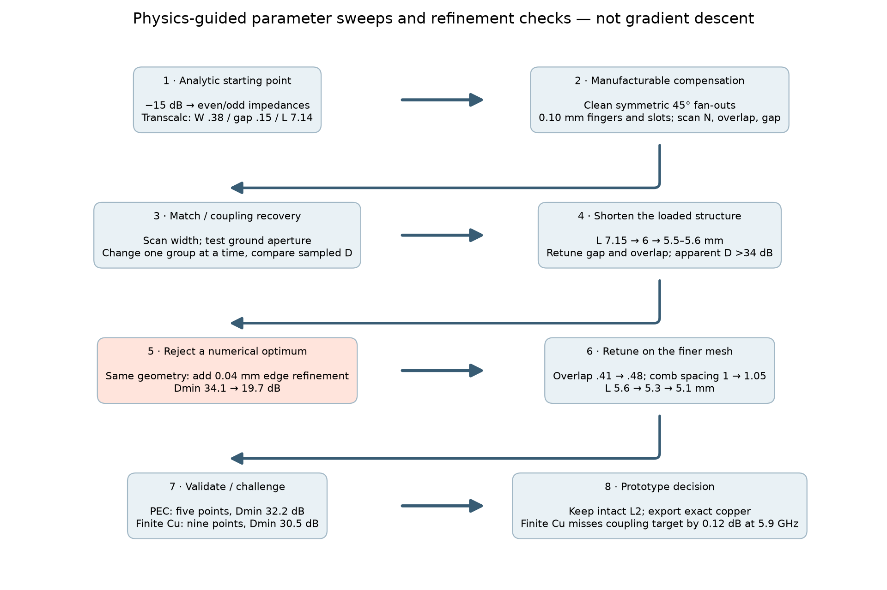
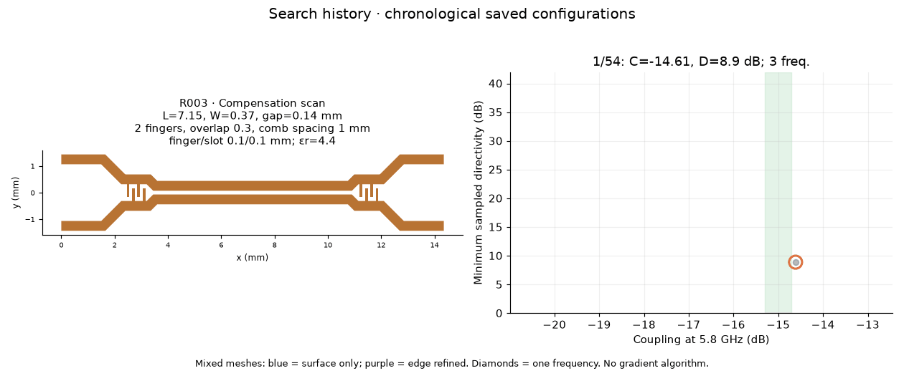
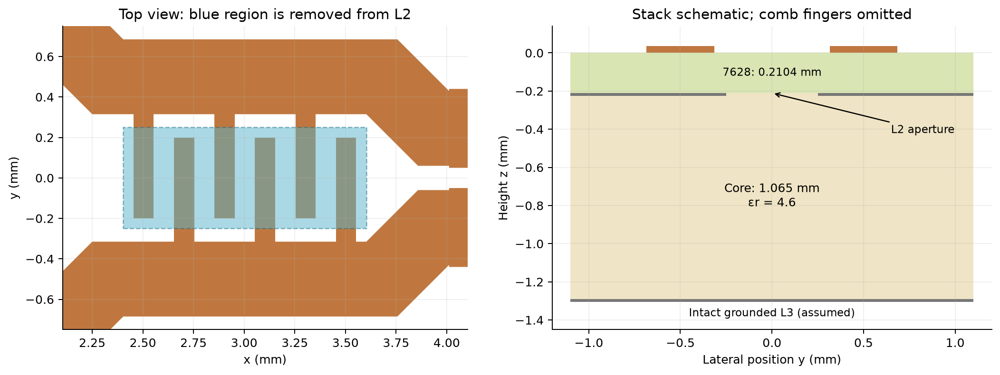
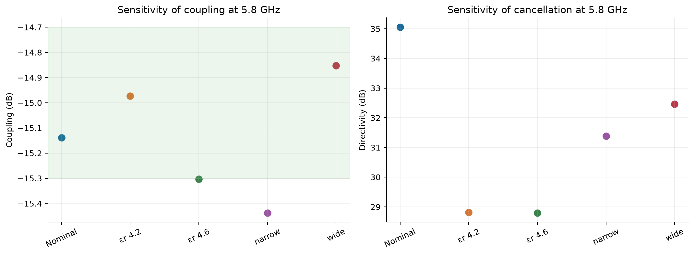

# TX Coupler EM Method

**5.8 GHz symmetric TX monitoring coupler · prototype candidate, not production released.** Target: $S_{31}=-15\pm0.3$ dB over 5.7–5.9 GHz, high directivity and good input match. All results below use **50 Ω at all ports**. Results are simulations, not hardware measurements.

## Selected design



| Dimension | Value, mm |
|---|---:|
| Coupled length $L$ | 5.10 |
| Coupled / feed width $W$ | 0.37 / 0.37 |
| Coupled edge gap $S$ | 0.13 |
| Comb bus centre spacing $Y$ | 1.05 |
| Straight comb station length $J$ | 1.20 |
| Fingers per side, per end | 3 |
| Finger width / slot | 0.10 / 0.10 |
| Overlap $O$ | 0.48 |
| Finger extension $(Y-W+O)/2$ | 0.58 |
| Tip-to-opposite-bus gap $(Y-W-O)/2$ | 0.10 |
| Comb span | 1.10 |

Both fan-outs use clean 45° diagonals; the tiny vertical remnants are removed. L2 ground remains intact. Nominal stack: $h=0.2104$ mm, $\varepsilon_r=4.4$, $\tan\delta=0.020$, top copper 35 µm, no soldermask. Geometry selection used PEC copper; the subsequent R058 check includes finite copper conductivity. The nominal 0.10 mm comb features exceed JLCPCB's published standard multilayer 1 oz 0.09/0.09 mm minimum; this is a geometry limit, not an etch-tolerance guarantee. [Stack](https://jlcpcb.com/impedance) · [Capabilities](https://jlcpcb.com/capabilities/Capab).

| 50 Ω metric | No comb, PEC | Selected comb, PEC | Selected comb, finite Cu |
|---|---:|---:|---:|
| $S_{31}$ at 5.8 GHz | −14.92 dB | −15.14 dB | −15.286 dB |
| $S_{41}$ at 5.8 GHz | −22.17 dB | −50.19 dB | −47.71 dB |
| Through loss at 5.8 GHz | 0.609 dB | 0.581 dB | 0.652 dB |
| Minimum sampled input return loss | 29.88 dB | 30.48 dB | 31.22 dB |
| Minimum sampled directivity | 7.11 dB | 32.16 dB | **30.50 dB** |
| Coupling range, 5.7–5.9 GHz | −14.97 to −14.89 dB | −15.27 to −15.02 dB | **−15.419 to −15.166 dB** |
| Direct EM frequency samples | 3 | 5 | 9 |

**Latest prediction: R058, finite copper.** Directivity remains above 30 dB, but coupling misses the −15.3 dB band limit by 0.119 dB at 5.9 GHz. The geometry remains the selected prototype candidate; it is not an all-requirements pass. Meeting the strict uncalibrated coupling window would require a small retune, or an explicit system decision to calibrate that offset.

The bare control was added after selection: it demonstrates the comb's effect but did not guide the original search. Both cases use the same requested mesh settings, including 0.04 mm edge refinement.



## 1. Idea → initial dimensions

For an ideal matched, equal-velocity, quarter-wave backward coupler:

$$k=10^{-15/20}=0.1778,\qquad Z_{0e}Z_{0o}=Z_0^2,$$
$$Z_{0e}=Z_0\sqrt{\frac{1+k}{1-k}}=59.85\ \Omega,\qquad Z_{0o}=Z_0\sqrt{\frac{1-k}{1+k}}=41.77\ \Omega.$$

Transcalc's rounded starting point was $W=0.38$, $S=0.15$, $L=7.14$ mm, with $\varepsilon_{\mathrm{eff},e}=3.549$ and $\varepsilon_{\mathrm{eff},o}=3.029$.



These are starting values for a uniform line. The combs and transitions add electrical loading, so the complete compensated structure need not retain a quarter-wave physical coupled section. The final section is only 5.10 mm.

### Why symmetry, and why compensation?

For a symmetric two-line network, even/odd decomposition gives

$$S_{31}=\frac{\Gamma_e-\Gamma_o}{2},\qquad S_{41}=\frac{T_e-T_o}{2},\qquad D=20\log_{10}\left|\frac{S_{31}}{S_{41}}\right|.$$

The isolated port depends on cancellation. In microstrip, the modes sample different dielectric distributions:

$$\theta_m=\frac{\omega L}{c}\sqrt{\varepsilon_{\mathrm{eff},m}},\qquad \varepsilon_{\mathrm{eff},e}>\varepsilon_{\mathrm{eff},o}\ \Rightarrow\ \theta_e>\theta_o.$$

Mirror-symmetric main routes remove an avoidable path imbalance and make the modal description useful. They do **not** remove the dielectric velocity difference, make the interdigital loading perfectly lumped, or guarantee better performance than every asymmetric layout. The recommendation rests on the simulated complete design.

### The fix: slow the odd mode

A bridge capacitor at each end sees zero voltage in the even mode. In the odd mode the lines are at $+V$ and $-V$:

$$I=j\omega C(V-(-V))=j\omega(2C)V.$$

Each half-circuit sees a shunt capacitance $2C$ to its virtual ground, with susceptance $B=2\omega C$.

**Step 1 — represent the odd-mode line.** A lossless line has an exact π equivalent with series impedance $jZ_{0o}\sin\theta_o$ and a shunt admittance at each end:

$$Y_{\mathrm{sh}}=jF(\theta_o),\qquad F(\theta)=\frac{\tan(\theta/2)}{Z_{0o}}.$$

**Step 2 — ask for extra electrical length.** Approximate the added shunt susceptance by the change an extra angle $\Delta\theta$ would produce:

$$F(\theta_o+\Delta\theta)-F(\theta_o)\simeq B.$$

**Step 3 — linearize that change.** Taylor's formula is $F(\theta+\Delta\theta)=F(\theta)+F'(\theta)\Delta\theta+O(\Delta\theta^2)$. The chain rule supplies the factor $1/2$:

$$F'(\theta)=\frac{1}{Z_{0o}}\frac{d}{d\theta}\tan(\theta/2)=\frac{\sec^2(\theta/2)}{2Z_{0o}}.$$

Subtract $F(\theta_o)$ and neglect the quadratic remainder:

$$\underbrace{\frac{\sec^2(\theta_o/2)}{2Z_{0o}}}_{\text{susceptance change per radian}}\ \underbrace{\Delta\theta}_{\text{extra radians}}\simeq2\omega C.$$

Differentiation is a local slope calculation: **slope × small angle change = added susceptance**. Angles must be in radians.

**Step 4 — use the quarter-wave approximation.** At $\theta_o\simeq\pi/2$, $\sec^2(\theta_o/2)\simeq2$. Set $\Delta\theta=\theta_e-\theta_o$:

$$\boxed{C\simeq\frac{\theta_e-\theta_o}{2\omega Z_{0o}}}.$$

The Transcalc starting point gives about **41 fF per end**. This is a sizing estimate: matching the π shunts alone does not also match the series arm, and the loaded network's effective impedance changes. It is not an exact broadband synthesis or a direct prescription for the final shortened structure.

## 2. Uncompensated EM → lumped-capacitor search

The question is: **if the bare EM coupler could be compensated with ideal capacitors, what value would it want?** We solve the bare geometry once, then reuse its four-port result as a circuit component. All the bends, dielectric loading and coupling already present in that EM result stay inside the component. Only the two capacitors are added outside it.



**In QUCS:**

1. Solve the uncompensated geometry with the four reference planes at the intended comb connection points, and export its complete 50 Ω S-matrix as a Touchstone `.s4p` file.
2. Place a **four-port S-parameter-file component** and load that file. Attach four 50 Ω RF ports; connect the component's additional reference pin to ground if it exposes one.
3. Add **Cleft between ports 1 and 3**, and **Cright between ports 2 and 4**. Give both the same parameter $C$. These are bridges between the signal lines, not shunt capacitors to physical ground. The $2C$ in the modal derivation is a half-circuit equivalent, not the component value to enter.
4. Run S-parameter analysis over 5.7–5.9 GHz and sweep $C$. Plot $S_{31}$, $S_{41}$ and $D=S_{31,\mathrm{dB}}-S_{41,\mathrm{dB}}$. Choose the best **minimum over the band**, not the deepest single-frequency isolation null.

[Ready-to-import 50 Ω Touchstone file](../../Frontend/emerge/catalogue/qucs/historical_bare_at_comb_50ohm.s4p) · [Circuit setup](../../Frontend/emerge/catalogue/qucs/README.md) · [QUCS S-parameter-file component](https://qucs.github.io/qucs-manual/0.0.19/html-en/component_reference.html).

The supplied plots solve this same linear circuit algebraically in Python; they are not screenshots of a QUCS run. **There is no second EM solve for each capacitor value.** Convert the saved 50 Ω S-matrix to Y and stamp the two capacitor admittances:

$$Y=\frac1{50}(I-S)(I+S)^{-1},\qquad Y'=Y+j\omega C\!\begin{bmatrix}1&0&-1&0\\0&1&0&-1\\-1&0&1&0\\0&-1&0&1\end{bmatrix},$$
$$S'=(I-50Y')(I+50Y')^{-1}.$$

The positive diagonal entries add current at each capacitor terminal; the negative off-diagonal entries enforce $I_a=j\omega C(V_a-V_b)$ and equal opposite current at the other terminal. Converting $Y'$ back to S gives the loaded four-port response, just as the QUCS circuit does.

**Placement matters:** moving the reference planes moves the virtual capacitors. Loading a full-feed file at the external board ports answers a different question from adding capacitors beside the coupled section. Use the truncated, at-comb network for this sizing exercise.



The panels show the sequence: too little capacitance under-corrects the leakage; near the optimum, the two contributions cancel; too much passes through the null and worsens isolation again. The coupling panel checks the cost of that compensation. The frequency–capacitance map shows why one capacitor value must be judged over the whole band.

This illustration reprocesses the **historical truncated geometry**, not the selected symmetric geometry. Its fitted network gives **85 fF/end and 25.78 dB minimum directivity at 50 Ω**. The older 76 fF / 37.6 dB result used modal references. The 41 fF analytic estimate and this 85 fF result describe different models and geometry; their difference is not an unexplained correction factor. The circuit result includes the actual saved network and its connection planes. No equivalent capacitance has been extracted for the final comb; 85 fF was not imposed on it.

**Role of the 2-D solver:** it informed the earlier cross-section estimates. The selected comb and 5.10 mm length came from full 3-D sweeps. A subsequent 2-D check of the final $W=0.37$, $S=0.13$ mm cross-section confirms a mode-velocity split but cannot model bends, finite combs or their placement. See [[Quasi-static 2-D Solver]].

## 3. Etched compensation → parameter search

The comb adds mutual and ground capacitance, distributed inductance and electrical length. A useful first-order separation is

$$C'_e=C'_g,\qquad C'_o=C'_g+2C'_m.$$

Changing the comb alters both terms. “Shorter fingers are always better” and “closer combs always increase coupling” are not general laws. Reducing finger reach can reduce unwanted loading; moving the comb changes the phase between the coupled section and compensating current. The vector sum can increase or decrease $S_{31}$ and $S_{41}$. These are plausible mechanisms, not a uniquely identified equivalent circuit.

**Method:** hand-selected, physics-guided parameter sweeps, local retuning and mesh checks. No gradient, adjoint, Bayesian or global optimizer was used. Multiple parameters sometimes changed together; the search does not isolate every parameter's independent effect.

$$\max_{\mathbf p}\ \min_{f\in\mathcal F}D(f;\mathbf p),\qquad -15.3\le S_{31,\mathrm{dB}}(f;\mathbf p)\le-14.7,$$

where $\mathcal F$ is the finite set of directly solved frequencies. This was the design criterion, not proof that a mathematical optimum was found.



| Step | What changed | Reason / finding |
|---|---|---|
| Manufacturable comb | 0.10 mm width/slot; 2 → 3 fingers; overlap 0.30 → 0.40 mm | Initial compensation was too weak; larger combs improved isolation but changed coupling. |
| Coupling / match | Gap 0.10–0.16 mm; widths 0.37–0.43 mm | Recover coupling and match with the complete comb present. |
| Loaded length | 7.15 → 6 → 5.5–5.6 mm, with gap/overlap retuning | Unloaded quarter-wave length was not optimal for the complete structure. |
| Mesh challenge | Same 5.6 mm geometry, add 0.04 mm edge refinement | Apparent minimum D fell **34.10 → 19.68 dB**. Reject that optimum. |
| Retune on edge mesh | Overlap 0.41 → 0.48 mm; $Y$ 1.00 → 1.05 mm | At 5.8 GHz, D recovered to 29.46 dB; coupling −15.45 dB. |
| Centre coupling | $L$ 5.6 → 5.3 → 5.1 mm | 5.3 mm gave 35.01 dB at one frequency; 5.1 mm passed nominal coupling at all five band samples. |
| Challenge final design | $\varepsilon_r$ 4.2/4.6; correlated ±10 µm widths/spaces | Directivity survived, but some coupling values missed the target. |

The complete matrix, original aliases and database are in [[Coupler Simulation Catalogue]]. **R052** is the selected prototype, **R057** its later bare control. Each redesign run retains its configuration, actual polygons, mesh counts and raw solved samples. Legacy fitted data are separately labeled.



The GIF follows saved configuration timestamps. Blue points use surface refinement only; purple includes edge refinement. Diamonds are one-frequency runs. It documents the search, not a ranking at equal numerical accuracy.

### Ground opening: tested, not selected



A 0.50 mm-wide L2 aperture was tested with a 1.065 mm core and intact grounded L3. On the same finer surface settings, minimum D changed **15.15 → 17.32 dB**; this was not an edge-converged result. The selected 32.16 dB candidate needs no aperture, retaining the simpler intact return plane.

## 4. Validation and production decision

| Check | Evidence | Remaining limitation |
|---|---|---|
| Nominal band | R058: 9 direct points at 25 MHz spacing; D 30.50–34.59 dB | Coupling misses the upper-band limit by 0.119 dB. |
| Mesh | 283,633 tetrahedra; edge 0.04, surface 0.15, port 0.10 mm | Further refinement or an independent solver must confirm the null. |
| Consistency | R058: maximum singular value 0.963703; reciprocity residual $8.91\times10^{-4}$ | Does not prove physical accuracy. |
| Export | Connected copper; nominal 0.10 mm opposite-net clearance | Import DRC is not fabrication or RF qualification. |
| Loss / environment | R058: finite copper, dielectric loss, bare copper, PEC box | Finish and roughness omitted; box and 50 Ω loads are accepted assumptions. |

The 0.05 mm port-control attempt selected an unphysical mode and was excluded. An earlier ground-placement suspicion was not confirmed: the dielectric won the original overlap by geometry priority. Neither establishes convergence of the present model.



| 5.8 GHz case | Coupling, dB | Directivity, dB |
|---|---:|---:|
| Nominal | −15.139 | 35.05 |
| $\varepsilon_r=4.2$ | −14.973 | 28.81 |
| $\varepsilon_r=4.6$ | −15.304 | 28.80 |
| Narrower copper / wider spaces | −15.437 | 31.39 |
| Wider copper / narrower spaces | −14.852 | 32.46 |

These earlier checks use PEC copper and were not repeated with finite copper loss. They are single-frequency illustrative corners, not supplier-guaranteed distributions. Widths change ±0.01 mm, gaps oppositely, and overlap with bus-edge movement. This is a correlated parameter perturbation, not a morphological etch model. The narrowest feature becomes 0.09 mm.

### Agreed scope and practical next step

For this power-monitoring application, the relevant outputs are coupling versus frequency, insertion loss, match and directivity. With matched ports, $P_3=|S_{31}|^2P_1$. **There is no requirement to measure or calibrate detector phase.** The EM solver still uses complex fields internally because interference determines isolation.

We retain the stated stack and material values, 50 Ω detector/P4 loads and the existing PEC enclosure model. EMerge assigns PEC to unassigned exterior domain faces; the lid is 2.5 mm above the board. This is a specific ideal metal box, not an open-space boundary. Via stitching is an implementation assumption and is not added to this model. An independent solver is optional, not a required gate for the next prototype.

**Completed follow-up, R058:** nine direct points at 25 MHz spacing, with $\sigma=5.8\times10^7$ S/m using EMerge's built-in surface-impedance boundary on the copper. Surface finish and roughness are omitted. At 5.8 GHz the skin depth is about 0.87 µm, much smaller than the 35 µm copper thickness, so a surface treatment avoids resolving the skin depth volumetrically. Saved geometry and mesh counts match the PEC case. Through loss increases by 0.0705 dB at 5.8 GHz; directivity there changes from 35.05 to 32.42 dB. The denser curve is smooth at all sampled points, with no newly resolved narrow feature. Frequency sampling is improved; this is not an additional mesh-convergence test.

“Sweep corners across the band” means repeating a frequency sweep for perturbed parameters—for example, εr=4.2 and 4.6 instead of nominal 4.4, or narrower/wider etched copper. The earlier corner checks were at 5.8 GHz only. They remain sensitivity illustrations; **a new full-band corner campaign is not part of the agreed next step**.

The useful next step is a prototype coupon with a through/reference structure, followed by coupling and directivity measurements. If −15±0.3 dB must be met without calibration, first retune the small coupling offset exposed by R058. Residual mesh error remains a limitation, but every possible board detail or another solver is not a prerequisite for making the coupon. Production release should follow measured performance; simulation is not hardware qualification.

## Files and reproduction

- [KiCad footprint](../../Frontend/kicad/FunRad_RF.pretty/FunRad_Coupler_5GHz8_Symmetric_15dB.kicad_mod) · [Import instructions](../../Frontend/kicad/README.md)
- [SQLite database](../../Frontend/emerge/catalogue/coupler_simulations.sqlite) · [Searchable table](../../Frontend/emerge/catalogue/index.html) · [[Coupler Simulation Catalogue]]

The SQLite file is generated locally and excluded from Git; rebuild it with `python coupler_catalogue.py`. Its source matrices, stable IDs and original run timestamps are committed.
- [[Quasi-static 2-D Solver]] — cross-section theory and final-geometry diagnostic.

Run in `Frontend/emerge` using the existing EMerge environment:

```text
python redesign.py redesign_configs/final51.json
python redesign.py redesign_configs/final51_bare.json
python redesign.py redesign_configs/final51_copper9.json
python final_cross_section_check.py
python coupler_catalogue.py
python coupler_story_figures.py
python export_coupler_footprint.py
```

`validate_coupler_footprint.py` uses KiCad's bundled Python. Completed EM runs are reused. The previous six documents and illustrations are preserved in Git checkpoint **36d3c8a**; the symmetry, audit, comb and separate redesign pages are consolidated here.
